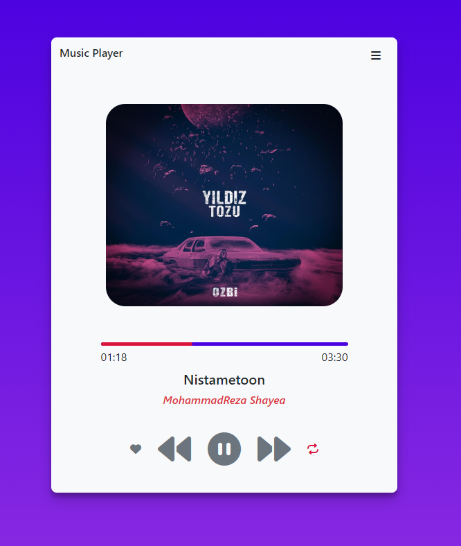

# Music-Player
Coding and development of a relatively professional music player using raw JavaScript, this music player is on the web and you can test it on different devices or use its codes.

## Preview

## Checklist Features

- The possibility of playing local music
- The option of next and previous music
- It is possible to display the information of the music being played, such as the cover - the name of the song - the name of the singer and...
- Ability to display the current duration of music
- Ability to display the full duration of music
- Ability to click for progress timeline to go to different parts of music
- The possibility of repeating music based on clicking on repeating music

